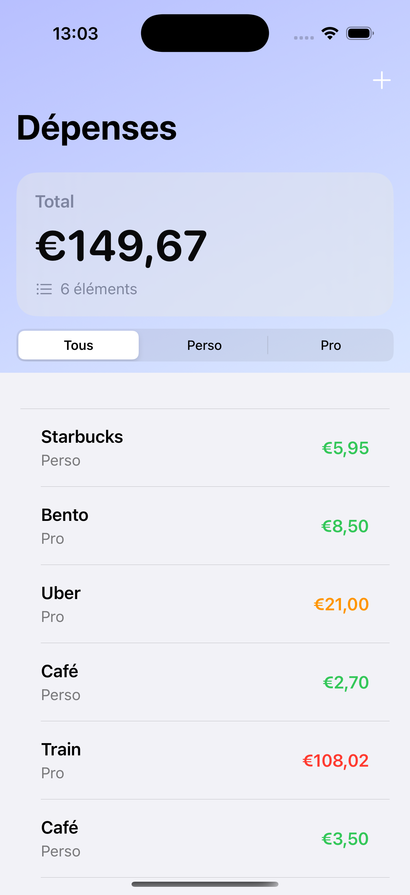
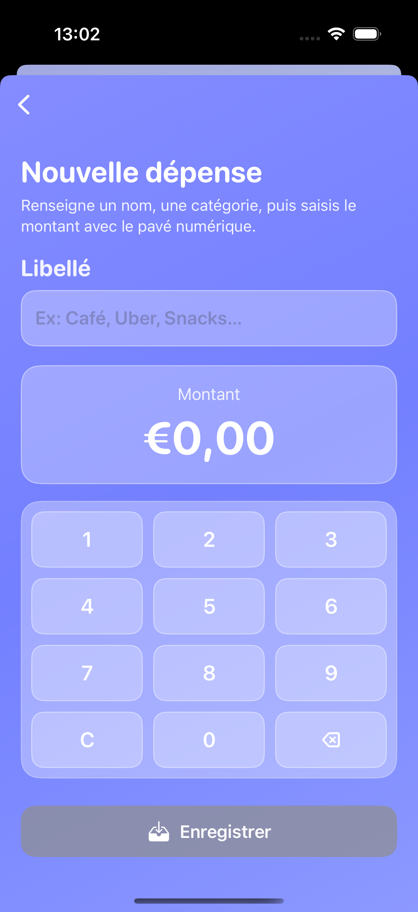
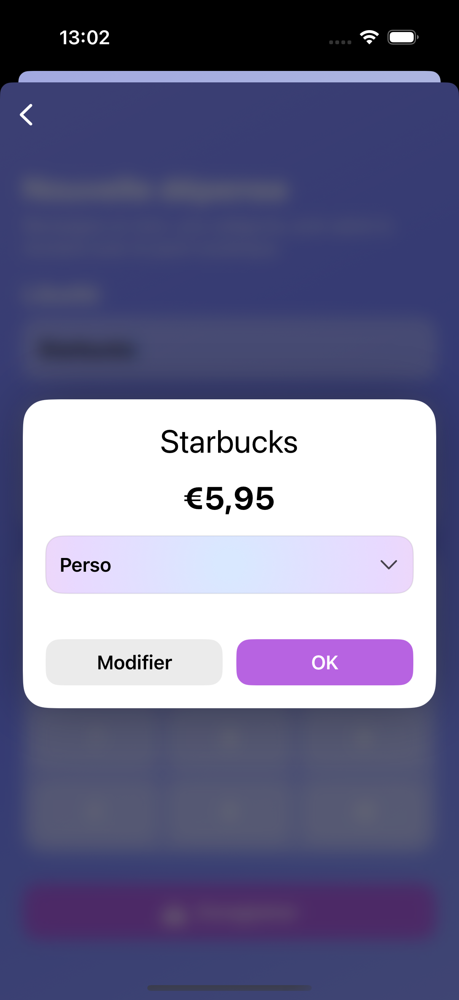

# TrackExpense
TrackExpense est une application iOS basée sur le projet iExpense de 100 Days of Swift, mais entièrement repensée : interface personnalisée, expérience utilisateur modernisée, et gestion claire des dépenses.

## Fonctionnalités
- Ajout rapide de dépenses
- Montant, description et type (personnel ou professionnel).
Sélection de devise locale.

## Catégorisation
- Séparation claire entre dépenses personnelles et professionnelles.
- Filtrage et affichage distinct pour chaque catégorie.

## Affichage et tri
- Liste ordonnée des dépenses avec formatage monétaire adapté.
- Mise en valeur visuelle des montants (petit / moyen / élevé).

## Persistance des données
- Sauvegarde locale via Codable et UserDefaults.
- Données restaurées automatiquement au relancement.

## Interface utilisateur
- Entièrement reconstruite avec SwiftUI.
- Design minimaliste, inspiré des Human Interface Guidelines.
- Support complet du Dark Mode.

## Utilisation
Lancer l’app : la liste des dépenses apparaît immédiatement.
Ajouter une dépense : bouton + en haut à droite → renseigner montant, description, catégorie.
Consulter les dépenses : basculez entre Personnel et Professionnel pour filtrer.
Gestion automatique : les dépenses sont sauvegardées localement et persistent entre les sessions.

## Technologies 
- Swift 5.9+
- SwiftUI 5 (architecture réactive, UI déclarative)
- MVVM pour séparer logique métier et interface
- Codable + UserDefaults pour la persistance
- Requiert Xcode 16+ et iOS 17+.

## Installation
```bash
git clone https://github.com/MelInfiny/TrackExpense.git
cd TrackExpense
open TrackExpense.xcodeproj
```
## Screenshots
<p align="center">
  &nbsp;&nbsp;
  &nbsp;&nbsp;
  &nbsp;&nbsp;
  &nbsp;&nbsp;
</p>

